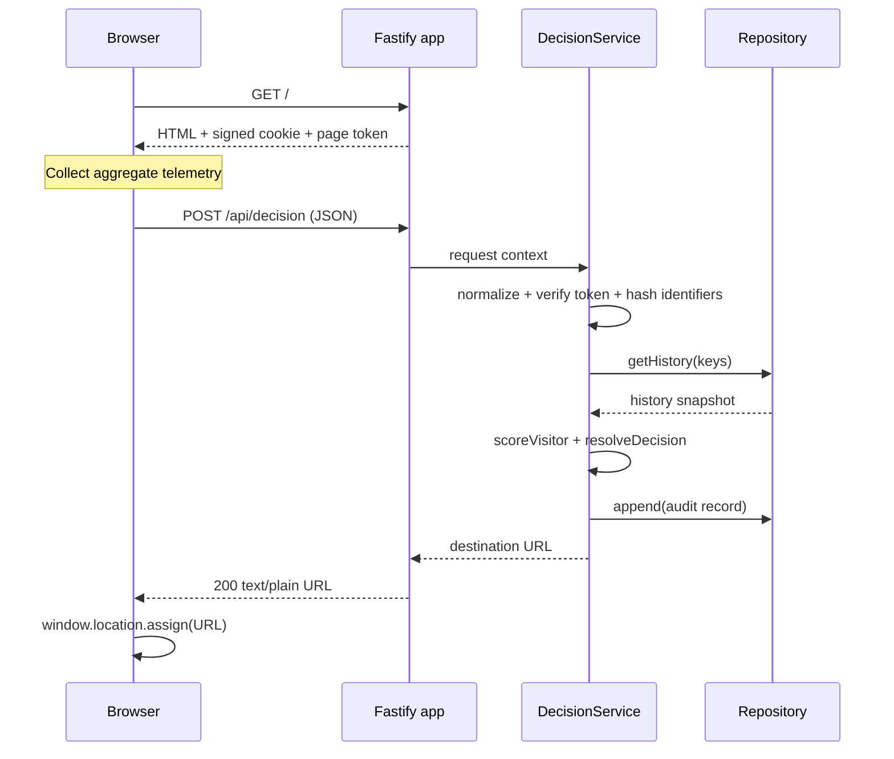
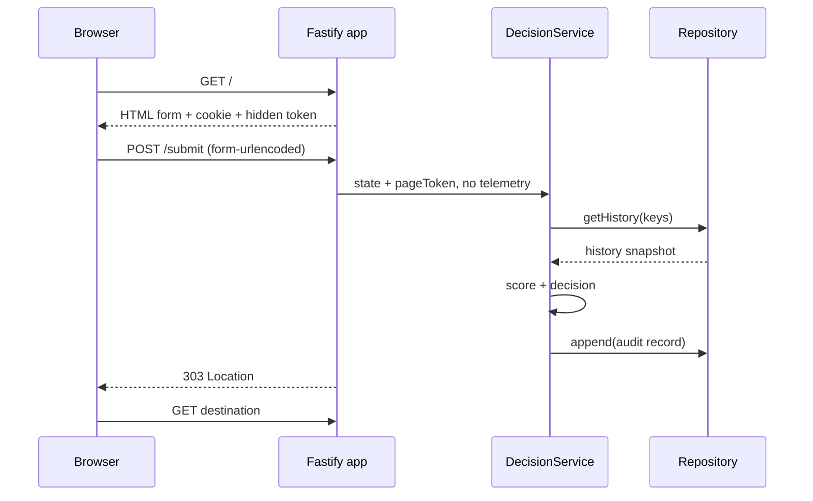

Оба потока используют одну normalization, scoring и audit pipeline. Различается
только способ submit и внешний HTTP-ответ.

## JavaScript flow

1. `GET /` создаёт visitor UUID, если signed cookie отсутствует или невалидна.
2. Сервер выпускает HMAC-signed page token с timestamp и random nonce.
3. `telemetry.js` собирает агрегаты до submit.
4. JSON payload проходит type/range normalization.
5. Backend строит server signals из headers, IP и token verification.
6. HMAC identifiers используются для history lookup.
7. Pure rule engine рассчитывает score и decision.
8. Audit записывается до отправки URL.

## No-JS flow

Hidden token подтверждает получение landing, но interaction fields отсутствуют.
Coverage default no-JS request обычно равна `0.55`, поэтому policy выбирает
`WHITEPAGE`, а не `BLOCK`.

## Parser и internal errors

Fastify parser errors на decision endpoints передаются в scorer как synthetic
payload, чтобы решение по возможности осталось в audit.

- `/api/decision` сохраняет `200 text/plain URL` contract;
- `/submit` сохраняет `303 Location` contract;
- если audit/decision pipeline сам падает, handler возвращает configured whitepage;
- в последнем случае audit текущей ошибки может отсутствовать.

## Порядок history update

History snapshot читается до текущего append. Поэтому score показывает состояние,
которое существовало перед decision. После append запись участвует в следующих
requests.

<Warning>
  `getHistory()` и `append()` не являются одной транзакцией. Два параллельных
  request могут увидеть одинаковый snapshot. Для production velocity нужен shared
  atomic counter или transactional repository.
</Warning>
