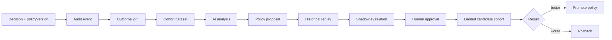

<Warning>
  Этот раздел описывает целевое развитие сервиса. Runtime policy, cohorts,
  outcome ingestion и AI-анализ **не реализованы** в текущей версии.
</Warning>

AI полезнее использовать не внутри request path, а в контуре развития scoring
policy. Синхронное решение посетителю должно оставаться быстрым, детерминированным
и воспроизводимым. AI получает накопленные результаты экспериментов, анализирует
когорты и предлагает новую конфигурацию, которую можно проверить, активировать
или откатить без изменения кода.

## Целевой lifecycle



AI не принимает решение `OFFER`, `WHITEPAGE` или `BLOCK` для отдельного request.
Его результат — versioned policy proposal с объяснением, ожидаемым эффектом и
данными, на которых построена рекомендация.

## Runtime policy config

Сейчас weights и thresholds находятся в TypeScript-коде. Первый необходимый шаг —
вынести их в immutable runtime-конфигурацию.

Предлагаемая версия policy должна содержать:

| Поле | Назначение |
|---|---|
| `engineVersion` | Версия кода, который интерпретирует правила |
| `policyVersion` | Уникальная immutable-версия weights и thresholds |
| `signalSchemaVersion` | Версия входных и производных сигналов |
| `basePolicyVersion` | Policy, относительно которой создано изменение |
| `weights` | Risk и intent deltas для правил |
| `thresholds` | Границы `OFFER`, `WHITEPAGE` и `BLOCK` |
| `status` | `draft`, `shadow`, `candidate`, `active` или `retired` |
| `createdBy` | Человек, сервис или AI proposal ID |
| `createdAt` | Время создания версии |

Упрощённый proposed format:

```json
{
  "engineVersion": "1.0.0",
  "policyVersion": "policy-2026-08-15.1",
  "signalSchemaVersion": "1",
  "basePolicyVersion": "policy-2026-08-01.2",
  "weights": {
    "VERY_FAST_SUBMIT": {
      "automationDelta": 40,
      "intentDelta": -25
    },
    "NORMAL_REPEAT_VISIT": {
      "automationDelta": -5,
      "intentDelta": 5
    }
  },
  "thresholds": {
    "whitepageRisk": 40,
    "blockRisk": 75,
    "minimumCoverage": 0.6,
    "minimumIntent": 35
  },
  "status": "draft"
}
```

Активная policy загружается как atomic snapshot. Один request от начала scoring до
audit использует одну и ту же версию, даже если во время обработки произошла
activation другой policy.

## Sticky cohorts

Для честного сравнения посетитель должен стабильно попадать в одну когорту в рамках
эксперимента. Assignment можно вычислять из HMAC visitor key и experiment salt:

```text
bucket = uint64(HMAC(experimentSalt, visitorKey)) mod 10000
```

Распределение задаётся в experiment config, например:

| Cohort | Доля | Поведение |
|---|---:|---|
| `control` | 70% | Текущая active policy |
| `candidate` | 20% | Новая candidate policy влияет на решение |
| `holdout` | 10% | Стабильная baseline policy для долгого сравнения |

`shadow` — отдельный режим выполнения: candidate policy рассчитывается параллельно,
но routing остаётся результатом active policy. В audit записываются обе оценки и
delta между ними.

Assignment не должен зависеть от рекламной платформы, campaign name, User-Agent
reviewer-а или предполагаемого типа посетителя. Один visitor сохраняет cohort при
повторных визитах, иначе результаты будут загрязнены переключением policy.

## Связь decision с outcome

Одного audit score недостаточно, чтобы понять качество policy. Каждой decision нужен
стабильный `decisionId`, через который позднее присоединяются outcome events.

Примеры outcomes:

- offer impression и успешный redirect;
- downstream conversion;
- bounce или отсутствие дальнейшего действия;
- confirmed automation/abuse label;
- chargeback, complaint или manual review result;
- техническая ошибка destination;
- время между decision и outcome.

Для анализа должны сохраняться как минимум:

```text
decisionId
timestamp
engineVersion
policyVersion
experimentId
cohortId
score dimensions
decision
reason groups
outcome type
outcome timestamp
```

Raw IP, полный payload и точный fingerprint не нужны AI для сравнения когорт. Перед
экспортом данные следует агрегировать или псевдонимизировать и ограничить retention.

## Что анализирует AI

AI получает cohort-level dataset и отвечает на конкретные вопросы:

- выросла ли conversion rate у `candidate` относительно `control`;
- изменились ли `WHITEPAGE` и `BLOCK` rates;
- какие rules чаще всего отличают false positive от confirmed automation;
- в каких сегментах coverage недостаточна;
- не ухудшились ли mobile, VPN, no-JS и repeat-user сценарии;
- какие correlated rules фактически дублируют друг друга;
- достаточно ли sample size для вывода;
- какие изменения weights объясняют наблюдаемую разницу.

Оптимизировать только conversion rate нельзя: policy может искусственно увеличить
конверсии, пропуская больше автоматизации. Анализ должен одновременно учитывать
business и safety metrics.

| Категория | Примеры метрик |
|---|---|
| Business | conversion rate, qualified offer rate, revenue per decision |
| Safety | confirmed automation pass rate, abuse rate, chargeback rate |
| False positives | valid-user whitepage/block rate, appeal/manual-review rate |
| Coverage | missing-signal rate, low-coverage share, schema compatibility |
| Operations | audit failure rate, policy load errors, decision latency |

## Формат AI proposal

AI возвращает не свободный текст для прямого исполнения, а структурированный draft:

```json
{
  "basePolicyVersion": "policy-2026-08-01.2",
  "proposalId": "proposal-184",
  "changes": [
    {
      "rule": "VERY_FAST_SUBMIT",
      "field": "automationDelta",
      "from": 45,
      "to": 40,
      "reason": "Candidate reduced mobile false positives without increasing confirmed automation pass rate"
    }
  ],
  "evidence": {
    "experimentId": "exp-fast-submit-03",
    "controlDecisions": 120000,
    "candidateDecisions": 41000
  },
  "confidence": "medium",
  "risks": [
    "Effect is weaker for low-coverage traffic"
  ]
}
```

Backend проверяет schema, допустимые диапазоны, существование rule IDs и совпадение
`basePolicyVersion`. Proposal с устаревшей base version нельзя активировать без
повторного анализа.

## Проверка перед activation

Каждое предложение проходит одинаковый pipeline:

1. Schema validation и policy invariants.
2. Existing fixtures, включая mobile, VPN, no-JS и repeat visits.
3. Historical replay на зафиксированном dataset.
4. Shadow comparison с текущей active policy.
5. Проверка minimum sample size и заранее заданных guardrail metrics.
6. Human approval с видимым diff weights и thresholds.
7. Ограниченная candidate cohort.
8. Promotion, продолжение эксперимента или rollback.

Activation создаёт новую immutable version; существующая policy не редактируется.
Rollback меняет active pointer на проверенную предыдущую версию и не требует deploy.

## Guardrails

- LLM не вызывается в синхронном decision path.
- AI не изменяет production policy без human approval.
- Любая рекомендация содержит base version, evidence и обратимый diff.
- Candidate не получает 100% трафика до прохождения staged rollout.
- Control/holdout сохраняются достаточно долго для сравнения.
- Raw identifiers и чувствительная telemetry не передаются внешней модели.
- Source-agnostic boundary остаётся неизменной для всех cohorts.
- AI не оптимизирует распознавание рекламных reviewers или platform crawlers.
- Missing outcome не считается автоматически ни успехом, ни automation label.

## Этапы внедрения

1. Добавить version fields в audit и immutable policy repository.
2. Реализовать runtime snapshot, activation и rollback.
3. Добавить sticky cohort assignment и shadow scoring.
4. Связать decisions с downstream outcomes.
5. Построить cohort metrics и статистические guardrails.
6. Подключить AI только для offline analysis и policy proposals.
7. Автоматизировать staged rollout, сохранив human approval для activation.

Такой контур использует AI там, где он действительно полезен: для поиска паттернов
в накопленных результатах и подготовки проверяемых гипотез. Runtime decision при
этом остаётся быстрым, объяснимым и полностью аудируемым.
