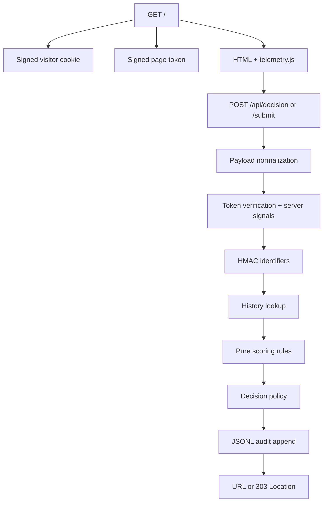

Система разделяет недоверенный HTTP-ввод, чистую scoring-логику и хранение
истории. Это позволяет проверять decision model без запуска Fastify или записи
на диск.

## Decision pipeline

## Модули

| Модуль | Ответственность | I/O boundary |
|---|---|---|
| `public/telemetry.js` | Агрегирует timing, interaction и coarse device context | Browser APIs → JSON payload |
| `src/telemetry/normalize.ts` | Ограничивает типы, размеры и диапазоны client input | `unknown` → normalized telemetry + issues |
| `src/telemetry/request-signals.ts` | Строит server-owned request context | Headers/IP/token → server signals |
| `src/security/` | Подписывает token и HMAC-хеширует identifiers | Secrets + values → signed/pseudonymous values |
| `src/scoring/rules.ts` | Декларативные risk/intent adjustments | Input + history → adjustments |
| `src/scoring/scorer.ts` | Суммирует risk, intent, coverage и evidence groups | Adjustments → `ScoreResult` |
| `src/scoring/policy.ts` | Применяет decision thresholds | Score → `OFFER`, `WHITEPAGE`, `BLOCK` |
| `src/services/decision-service.ts` | Оркестрирует один decision | Request context → outcome + audit |
| `src/storage/decision-repository.ts` | JSONL persistence и history lookup | Audit records ↔ file/memory |
| `src/app.ts` | Fastify routes и внешний контракт | HTTP ↔ destination URL/redirect |

## Чистое ядро

`scoreVisitor()` и `resolveDecision()` не читают environment, headers, clock или
disk. Тест передаёт им готовые `NormalizedDecisionInput` и `HistorySignals` и
получает детерминированный результат.

I/O остаётся снаружи:

- Fastify получает HTTP request;
- normalization не доверяет payload;
- service вычисляет identifiers и загружает history;
- repository сериализует audit append;
- route возвращает только выбранный destination.

## Server-issued evidence

Page token содержит `issuedAtMs` и случайный nonce, подписанные HMAC-SHA256.
Backend проверяет signature, TTL и future skew, а затем рассчитывает server dwell
без доверия к client timestamps.

Signed visitor cookie даёт устойчивую identity для repeat/velocity history.
Fingerprint остаётся слабым дополнительным identifier и также HMAC-хешируется
для индекса.

## Storage boundary

JSONL выбран для portable take-home запуска:

- нет database server и native bindings;
- запись легко проверить вручную;
- repository interface можно заменить без изменения scorer-а.

Ограничения осознанны:

- все записи загружаются в память;
- lookup линейный;
- нет multi-process lock;
- history lookup и append не являются общей транзакцией;
- нет retention и partitioning.

<Warning>
  JSONL подходит для одного demo process, но не является рекомендуемым
  production storage для большого платного трафика.
</Warning>

## Ключевые файлы

- [`src/app.ts`](https://github.com/ArtemioPanzini/cloak/blob/main/src/app.ts)
- [`src/services/decision-service.ts`](https://github.com/ArtemioPanzini/cloak/blob/main/src/services/decision-service.ts)
- [`src/scoring/scorer.ts`](https://github.com/ArtemioPanzini/cloak/blob/main/src/scoring/scorer.ts)
- [`src/scoring/policy.ts`](https://github.com/ArtemioPanzini/cloak/blob/main/src/scoring/policy.ts)
- [`src/storage/decision-repository.ts`](https://github.com/ArtemioPanzini/cloak/blob/main/src/storage/decision-repository.ts)
